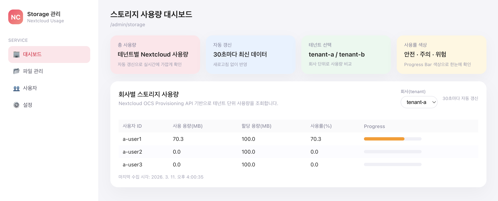
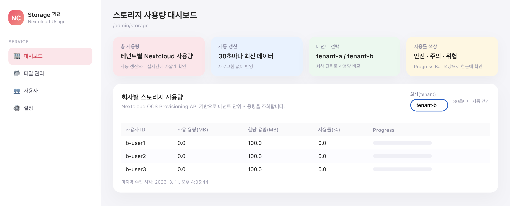

# Nextcloud 멀티테넌트 스토리지 사용량 대시보드

## 프로젝트 개요

본 프로젝트는 **Nextcloud를 기반으로 한 멀티테넌트 스토리지 사용량 모니터링 시스템**입니다.

각 회사(tenant)는 **Nextcloud Group**으로 매핑되며, 해당 그룹에 속한 사용자들의 스토리지 사용량을 조회할 수 있습니다.

관리자 페이지에서는 다음 정보를 확인할 수 있습니다.

- 사용자 ID
- 사용 용량
- 할당 용량
- 사용률(%)
- 테넌트별 사용자 목록

Backend 서버는 **Nextcloud OCS API**를 통해 사용자 스토리지 정보를 조회하고,  
Frontend에서는 이를 시각적으로 표시합니다.

---

# 시스템 아키텍처

```bash
React Frontend
⬇
Node.js Backend (Express)
⬇
Nextcloud OCS API
⬇
Nextcloud Storage
```

---

# 주요 기능

- Docker 기반 Nextcloud 로컬 환경 구축
- Nextcloud Group 기반 멀티테넌트 구조 구현
- 사용자별 스토리지 사용량 조회
- 테넌트 단위 사용자 사용량 API 제공
- 관리자용 스토리지 사용량 대시보드
- Progress Bar 기반 사용률 시각화
- Nextcloud API 오류 처리

---

# 프로젝트 구조

```bash
NextCloud_MultiTenant_Usage

├ backend
│ ├ src
│ ├ package.json
│ └ .env.example

├ frontend
│ ├ src
│ └ package.json

├ nextcloud
│ ├ docker-compose.yml
│ └ .env.example

├ .gitignore
└ README.md
```

---

# 실행 방법

## 1. Repository Clone

```bash
git clone https://github.com/mjlee76/NextCloud_MultiTenant_Usage.git
cd NextCloud_MultiTenant_Usage
```

---

# Nextcloud 설치

본 프로젝트는 Docker Compose를 이용해 로컬 환경에서 Nextcloud를 실행합니다.

## 1. Docker 및 Docker Compose 확인

다음 명령어로 Docker가 설치되어 있는지 확인합니다.

```bash
docker --version
docker compose version
```

Docker가 설치되어 있지 않다면 아래 공식 문서를 참고하여 설치합니다.

https://docs.docker.com/get-docker/

## 2. Nextcloud 환경 변수 파일 생성

```bash
cp nextcloud/.env.example nextcloud/.env
```

## 3. Nextcloud 컨테이너 실행

```bash
cd nextcloud
docker compose up -d
```

실행이 완료되면 Nextcloud 서버가 로컬에서 실행됩니다.

브라우저에서 다음 주소로 접속합니다.

```text
http://localhost:8080
```

이후 관리자 계정을 생성하거나 `.env`에 설정된 관리자 계정으로 로그인할 수 있습니다.

---

# Nextcloud 설정

## 1. 환경 변수 파일 생성

```bash
cp nextcloud/.env.example nextcloud/.env
```

`.env` 파일 예시

```bash
POSTGRES_DB=nextcloud
POSTGRES_USER=nextcloud
POSTGRES_PASSWORD=your-postgres-password

NEXTCLOUD_ADMIN_USER=admin
NEXTCLOUD_ADMIN_PASSWORD=your-nextcloud-admin-password
```

---

## 2. Nextcloud 실행

```bash
cd nextcloud
docker compose up -d
```

브라우저 접속

```bash
http://localhost:8080
```

---

# Nextcloud 초기 설정

## 1. 그룹 생성

다음 두 개의 그룹을 생성합니다.

tenant-a
tenant-b

---

## 2. 사용자 생성

각 그룹에 최소 3명의 사용자를 생성합니다.

### tenant-a

a-user1
a-user2
a-user3

### tenant-b

b-user1
b-user2
b-user3

---

## 3. 사용자 그룹 할당

각 사용자를 해당 그룹에 할당합니다.

tenant-a → a-user1, a-user2, a-user3
tenant-b → b-user1, b-user2, b-user3

---

## 4. 사용자 스토리지 할당량 설정

모든 사용자에게 다음과 같이 설정합니다.

Quota: 100MB

---

## 5. 테스트 데이터 생성

다음 사용자에게 테스트 파일을 업로드합니다.

a-user1 → 50MB 이상 파일 업로드

---

# Backend 실행

## 1. 환경 변수 파일 생성

```bash
cp backend/.env.example backend/.env
```

`.env` 예시

```bash
NEXTCLOUD_BASE_URL=http://localhost:8080
NEXTCLOUD_USERNAME=admin
NEXTCLOUD_APP_PASSWORD=your-nextcloud-app-password

NEXTCLOUD_TENANT_GROUP_PREFIX=

PORT=3000
```

---

## 2. Backend 실행

```bash
cd backend
npm install
npm run dev
```

Backend 서버

```bash
http://localhost:3000
```

---

# Frontend 실행

```bash
cd frontend
npm install
npm run dev
```

브라우저 접속

```bash
http://localhost:5173
```

---

# API

## 사용자 스토리지 사용량 조회

GET /api/admin/tenants/{tenantId}/users-usage

예시

```bash
curl http://localhost:3000/api/admin/tenants/tenant-a/users-usage
```

---

## 응답 예시

```bash
{
    “tenantId”: “tenant-a”,
    “users”: [
        {
            “userId”: “a-user1”,
            “usedBytes”: 52428800,
            “quotaBytes”: 104857600,
            “usagePercent”: 50,
            “lastCollectedAt”: “2026-03-11T06:02:33.444Z”
        }
    ]
}
```

---

# 오류 처리

Nextcloud API 호출에 실패할 경우 Backend는 다음과 같은 응답을 반환합니다.

```bash
{
    “error”: “NEXTCLOUD_API_ERROR”,
    “message”: “Failed to fetch data from Nextcloud”
}
```

# 실행 화면

관리자 페이지에서 테넌트별 사용자 스토리지 사용량을 확인할 수 있습니다.




---

# 기술 스택

Frontend

- React
- Axios

Backend

- Node.js
- Express
- Axios

Infrastructure

- Docker
- Nextcloud
- PostgreSQL

---